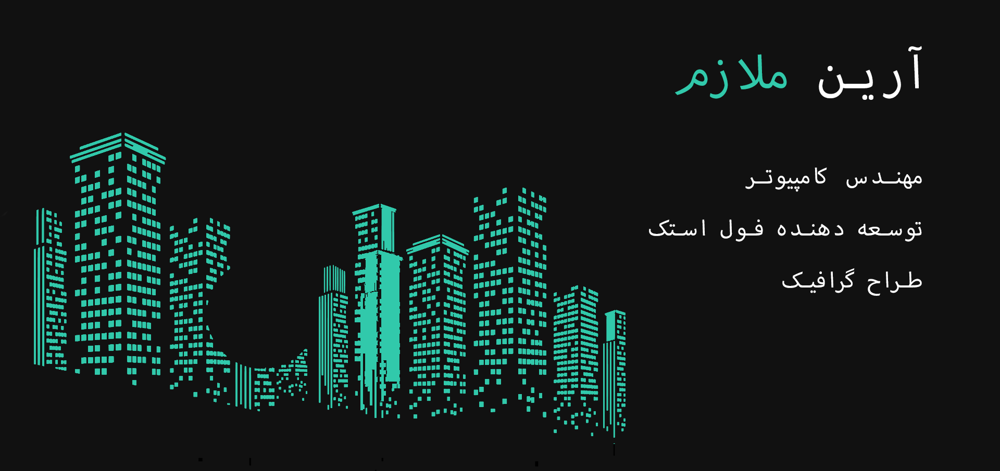

    

# سلام! 👋

من یک مهندس کامپیوتر و توسعه دهنده فول استک جاوااسکریپت هستم. بیش از 3 سال تجربه در زمینه توسعه وب دارم. از ترکیب ایده‌های جدید با برنامه‌نویسی لذت می‌برم و با کد نویسی به راه خود پیش می‌روم و مشکلات را حل می‌کنم. همیشه سعی می‌کنم طرح‌های جدید و منحصر به فرد ایجاد و استفاده کنم.

برای دیدن برخی از کارهای من، وب‌سایت من را ببینید.

<https://ariyanmolazem.ir>

## مهارت های من

&nbsp;&nbsp;&nbsp;&nbsp;  &nbsp;&nbsp;&nbsp;&nbsp;  &nbsp;&nbsp;&nbsp;&nbsp; 

&nbsp;&nbsp;&nbsp;&nbsp; &nbsp;&nbsp;&nbsp;&nbsp; &nbsp;&nbsp;&nbsp;&nbsp; &nbsp;&nbsp;&nbsp;&nbsp; &nbsp;&nbsp;&nbsp;&nbsp; &nbsp;&nbsp;&nbsp;&nbsp; &nbsp;&nbsp;&nbsp;&nbsp;&nbsp;&nbsp;&nbsp;&nbsp; 

&nbsp;&nbsp;&nbsp;&nbsp; &nbsp;&nbsp;&nbsp;&nbsp; &nbsp;&nbsp;&nbsp;&nbsp; &nbsp;&nbsp;&nbsp;&nbsp; &nbsp;&nbsp;&nbsp;&nbsp; 

## زبان ها

- انگلیسی
- فارسی
- آلمانی

## ارتباط با من

