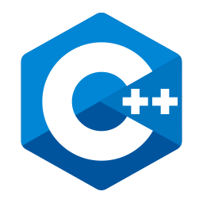

    

# سلام! 👋

من یک مهندس کامپیوتر و توسعه دهنده فول استک جاوااسکریپت هستم. بیش از 3 سال تجربه در زمینه توسعه وب دارم. از ترکیب ایده‌های جدید با برنامه‌نویسی لذت می‌برم و با کد نویسی به راه خود پیش می‌روم و مشکلات را حل می‌کنم. همیشه سعی می‌کنم طرح‌های جدید و منحصر به فرد ایجاد و استفاده کنم.

برای دیدن برخی از کارهای من، وب‌سایت من را ببینید.

<a href="https://ariyanmolazem.ir">
  

    
     
    
  

</a>

## بزار یک جوک برات تعریف کنم!

## مهارت های من

<table>
  <tr align="center">
    <td>Javascript</td>
    <td>Typescript</td>
    <td>Python</td>
  </tr>
  <tr align="center">
    <td></td>
    <td></td>
    <td></td>
  </tr>
  <tr align="center">
    <td>C++</td>
    <td>Html</td>
    <td>Css</td>
  </tr>
  <tr align="center">
    <td></td>
    <td></td>
    <td></td>
  </tr>
  <tr align="center">
    <td>React.js</td>
    <td>React Query</td>
    <td>Redux.js</td>
  </tr>
  <tr align="center">
    <td></td>
    <td></td>
    <td></td>
  </tr>
  <tr align="center">
    <td>Svelte.js</td>
    <td>React Native</td>
    <td>Three.js</td>
  </tr>
  <tr align="center">
    <td></td>
    <td></td>
    <td></td>
  </tr>
  <tr align="center">
    <td>Tailwindcss</td>
    <td>Gsap</td>
    <td>Framer Motion</td>
  </tr>
  <tr align="center">
    <td></td>
    <td></td>
    <td></td>
  </tr>
  <tr align="center">
    <td>Next.js</td>
    <td>Sveltekit.js</td>
    <td>Node.js</td>
  </tr>
  <tr align="center">
    <td></td>
    <td></td>
    <td></td>
  </tr>
  <tr align="center">
    <td>Express.js</td>
    <td>MongoDB</td>
    <td>MySql</td>
  </tr>
  <tr align="center">
    <td></td>
    <td></td>
    <td></td>
  </tr>
  <tr align="center">
    <td>GraphQL</td>
    <td>Git</td>
    <td>Vite</td>
  </tr>
  <tr align="center">
    <td></td>
    <td></td>
    <td></td>
  </tr>
</table>

## زبان ها

- انگلیسی
- فارسی
- آلمانی

## ارتباط با من

