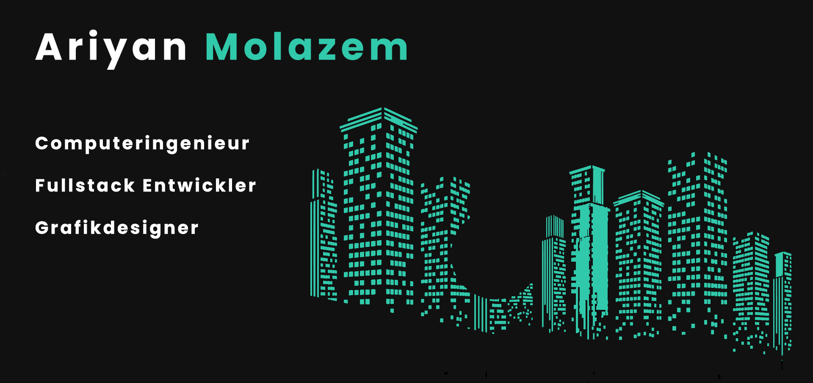

&nbsp;&nbsp;&nbsp;&nbsp;

# Hallo! 👋
Ich bin ein Computeringenieur und ein Javascript Fullstack-Entwickler. Ich habe über 3 Jahre Erfahrung in der Webentwicklung. Ich genieße es, neue Ideen mit Programmierung zu kombinieren, Probleme zu lösen und meinen eigenen Weg zu codieren. Ich versuche immer, neue und einzigartige Designs zu erstellen und zu verwenden.

Besuchen Sie meine Website, um einige meiner Arbeiten zu sehen.  
<https://ariyanmolazem.ir>

## meine Fähigkeiten
&nbsp;&nbsp;&nbsp;&nbsp;  &nbsp;&nbsp;&nbsp;&nbsp;  &nbsp;&nbsp;&nbsp;&nbsp; 

&nbsp;&nbsp;&nbsp;&nbsp; &nbsp;&nbsp;&nbsp;&nbsp; &nbsp;&nbsp;&nbsp;&nbsp; &nbsp;&nbsp;&nbsp;&nbsp; &nbsp;&nbsp;&nbsp;&nbsp; &nbsp;&nbsp;&nbsp;&nbsp;&nbsp;&nbsp;&nbsp;&nbsp; 

&nbsp;&nbsp;&nbsp;&nbsp; &nbsp;&nbsp;&nbsp;&nbsp; &nbsp;&nbsp;&nbsp;&nbsp; &nbsp;&nbsp;&nbsp;&nbsp; &nbsp;&nbsp;&nbsp;&nbsp; 

## Sprachen
* Englisch
* Persisch
* Deutsch
## mich erreichen

