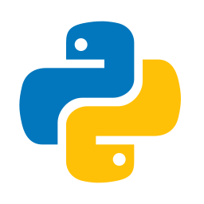
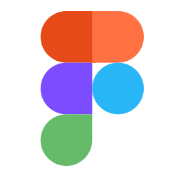

&nbsp;&nbsp;&nbsp;&nbsp;

# Hi there! 👋

I'm a Computer Engineer and a Javascript Fullstack Developer. I have over 3 years of experience developing web. I enjoy combining new ideas
with programming and code my way to it and solve the problems. I
always try to create and use new and unique designs.

Visit my website to see some of my works.

<https://ariyanmolazem.ir>

## Let me tell you a joke!

## my Skills

<table>
  <tr align="center">
    <td>Javascript</td>
    <td>Typescript</td>
    <td>Python</td>
    <td>C++</td>
  </tr>
  <tr align="center">
    <td></td>
    <td></td>
    <td></td>
    <td></td>
  </tr>
  <tr align="center">
    <td>Html</td>
    <td>Css</td>
    <td>React.js</td>
    <td>React Query</td>
  </tr>
  <tr align="center">
    <td></td>
    <td></td>
    <td></td>
    <td></td>
  </tr>
  <!--<tr align="center">
    <td>Redux.js</td>
    <td></td>
    <td>Svelte.js</td>
    <td></td>
  </tr>
  <tr align="center">
    <td>Tailwindcss</td>
    <td></td>
    <td>Three.js</td>
    <td></td>
  </tr>
  <tr align="center">
    <td>React Native</td>
    <td></td>
    <td>Gsap</td>
    <td></td>
  </tr>
  <tr align="center">
    <td>Figma</td>
    <td></td>
    <td>Git</td>
    <td></td>
  </tr>
  <tr align="center">
    <td>Next.js</td>
    <td></td>
    <td>Sveltekit.js</td>
    <td></td>
  </tr>
  <tr align="center">
    <td>Node.js</td>
    <td></td>
    <td>Express.js</td>
    <td></td>
  </tr>
  <tr align="center">
    <td>MongoDB</td>
    <td></td>
    <td>MySql</td>
    <td></td>
  </tr>
  <tr align="center">
    <td>GraphQL</td>
    <td></td>
    <td>Svelte is my favorite one!</td>
    <td>❤️</td>
  </tr> -->
</table>

## Languages

- English
- Persian
- German

## Reach Me

